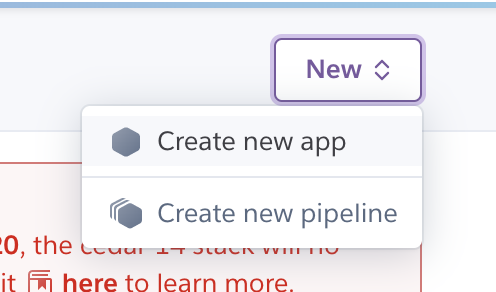
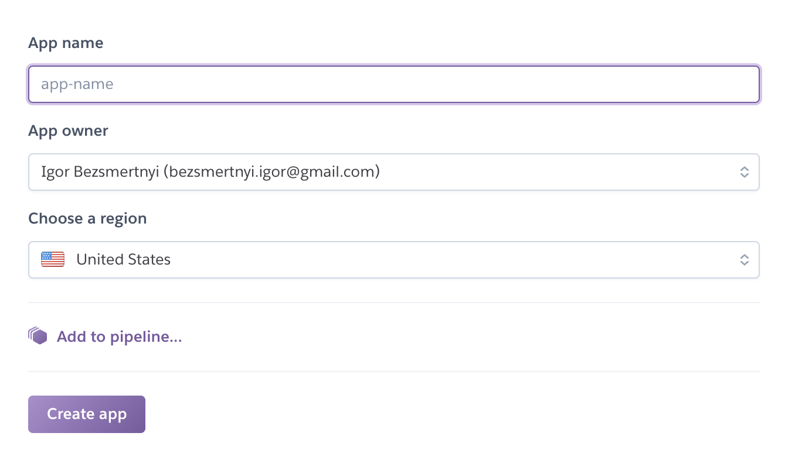
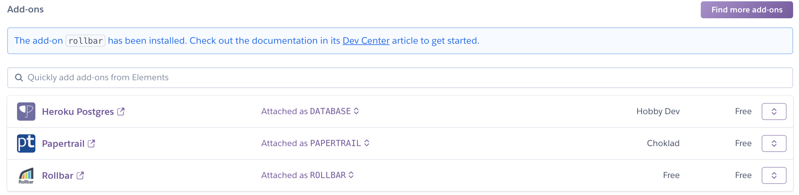
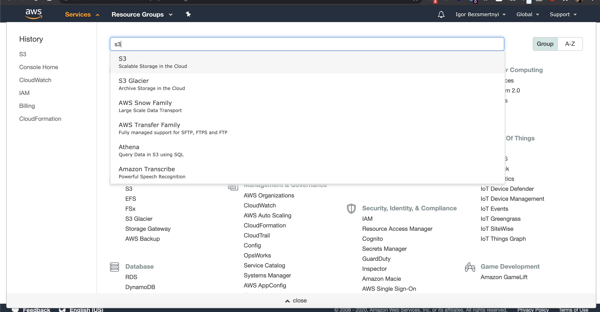
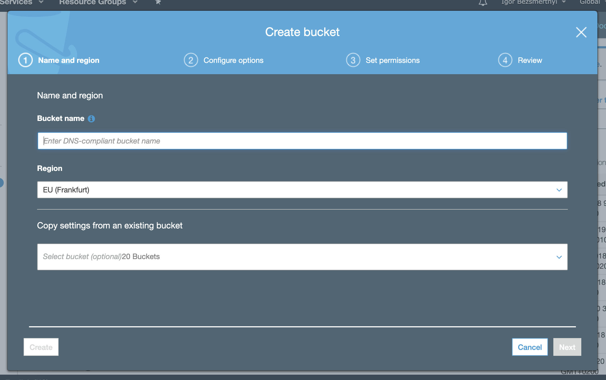
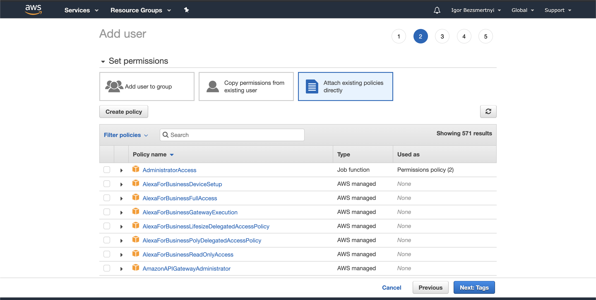
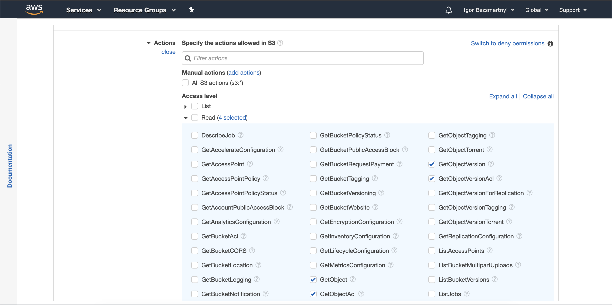
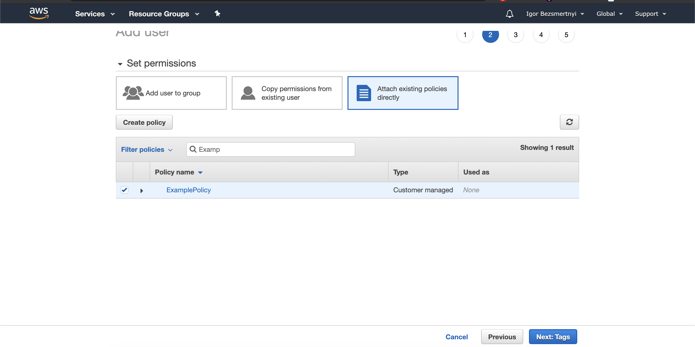
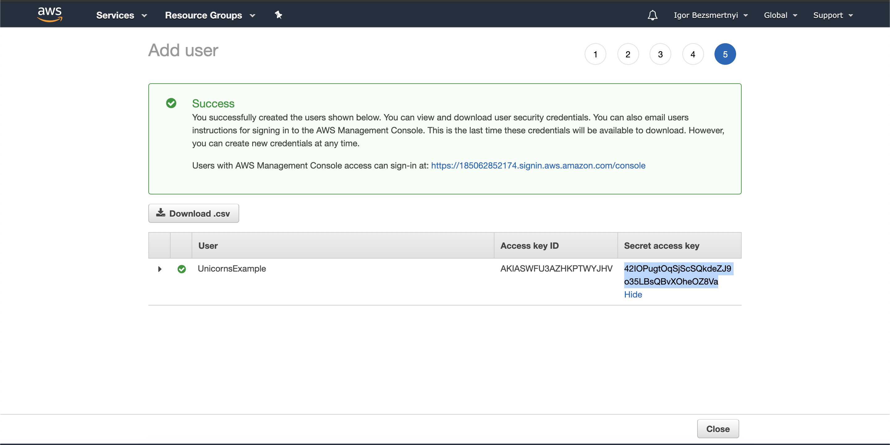

# Unikorns Starter-Kit


This project is designed to simplify the lives of developers and reduce routine processes during setting up a [Gatsby](https://www.gatsbyjs.org/) and [Strapi](https://strapi.io/) projects

---

## Required tools:

| Package | Version    |
|---------|------------|
| Docker  |`>= 19.03.8`|
| NodeJS  |`>= 13.7.0` |

<br />

# Table of Contents

1. [Installation](#Installation)
2. [Development](#Development)
3. [Deployment](#Deployment)
4. [Troubleshoot](#Troubleshoot)

---

## Installation

Make sure that you have installed all [required tools](#Required-tools) installed on your local machine.

### CMS
For install CMS dependencies run next command in your terminal

__within Docker__

```bash
$ cd cms
$ docker-compose up
```

__without Docker__

```bash
$ cd cms
$ npm i
```

### Frontend
For install Frontend dependencies run next command in your terminal

```bash
$ cd frontend
$ npm i
```

## Development
Before start development process make sure that you successfully completed [Installation](#Installation) step

In first let's create `.env` file in project root directory and copy content from `.env.example` file to it. You should do this operation in `cms` directory as long as in `frontend`.

For starting development process run following commands in your terminal

__within Docker__

```bash
# window #1
$ cd cms
$ cd docker-compose up

# window #2
$ cd frontend
$ npm run develop
```

__without Docker__

Before run CMS should make one extra step. Open `.env` file in `cms` directory and update next line:

```yml
# DATABASE_HOST=postgres # old value

DATABASE_HOST=127.0.0.1 # new value
```

Now we can run CMS without docker container

```bash
# window one
$ cd cms
$ cd npm run develop

# window two
$ cd frontend
$ npm run develop
```

__within remote CMS__

If you want use data from remote CMS, you should update `.env` file in `frontend` directory

```yml
# GATSBY_CMS_URL=http://localhost:1337 # old value

GATSBY_CMS_URL=https://remote-cms-url.com # new value
```

## Deployment
Before deploy application make sure that you have credentials to Heroku and AWS accounts and installed Heroku CLI.

### Create heroku application:

Navigate to Heroku dashboard and click on __New > Create new app__

<details>
  <summary>Example</summary>
  
</details>

<br/>

Provide application name and select the region. _(The region should depends to client business location)_

<details>
  <summary>Example</summary>
  
</details>

<br/>

Add addons to application:

`Heroku Postgres` - Database
<br/>
`Papertrail` - Server Logs
<br/>
`Rollbar` - Error monitoring
<br/>
`Heroku Scheduler` - Scheduled scripts

<details>
  <summary>Example</summary>
  
</details>

<br/>

After application created open your terminal window and run the next command:

```bash
$ heroku stack:set container -a your_application
```

<br/>

Config `alive script`
For make the instance be always available on free plan, we should set up [alive script](/cms/scripts/jobs/alive-instance.js) in Heroku Scheduler

<details>
  <summary>Example</summary>
  
</details>

<br/>

### Config file upload:

Navigate to AWS dashboard search for S3 service and click on __Create bucket__ bucket button

1. Provide bucket name
2. On __Set permissions__ step choose options from the screenshot belowe
3. Create the buckent 

<details>
  <summary>Example</summary>
  
  
  
</details>

Create [`IAM`](https://aws.amazon.com/iam/) use for this bucket.

Navigate to __IAM > Users > Add user__

Provide User name and select __Programmatic access__
<details>
  <summary>Example</summary>
  
</details>

Go to the next step and select __Attach existing policies directly__ option. Then click on __Create policy__ button
<details>
  <summary>Example</summary>
  
</details>

In new window, choose S3 service and attach next actions.
  1. __Read > GetObject__
  2. __Read > GetObjectAcl__
  3. __Read > GetObjectVersion__
  4. __Read > GetObjectVersionAcl__
  5. __Write > DeleteObject__
  6. __Write > DeleteObjectVersion__
  7. __Write > PutObject__
  8. __Permissions management > PutObjectAcl__
  9. __Permissions management > PutObjectVersionAcl__
<details>
  <summary>Example</summary>
  
</details>

In __Resources__ section provide S3 bucket name and allowe all objects via `*` symbol
<details>
  <summary>Example</summary>
  
</details>

Go to the next step and provide __Policy name__

Return to the previous page and search for created Policy
<details>
  <summary>Example</summary>
  
</details>

Create new User and save credentials
<details>
  <summary>Example</summary>
  
</details>

Now let's config heroku environment variables. Open Heroku application and navigate to __Settings__. Create the next variables and fill them with values from __User__ credentials and __S3__ bucket data

```yml
AWS_ACCESS_KEY_ID     # AWS User Access key ID
AWS_SECRET_ACCESS_KEY # AWS User Secret access key
S3_BUCKET             # S3 bucket name
S3_REGION             # S3 bucket region
```

## Troubleshoot
